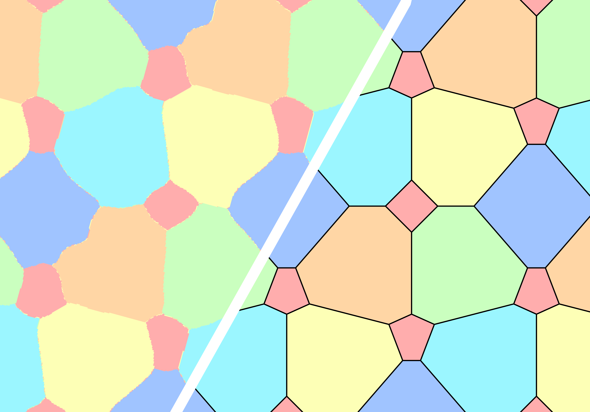
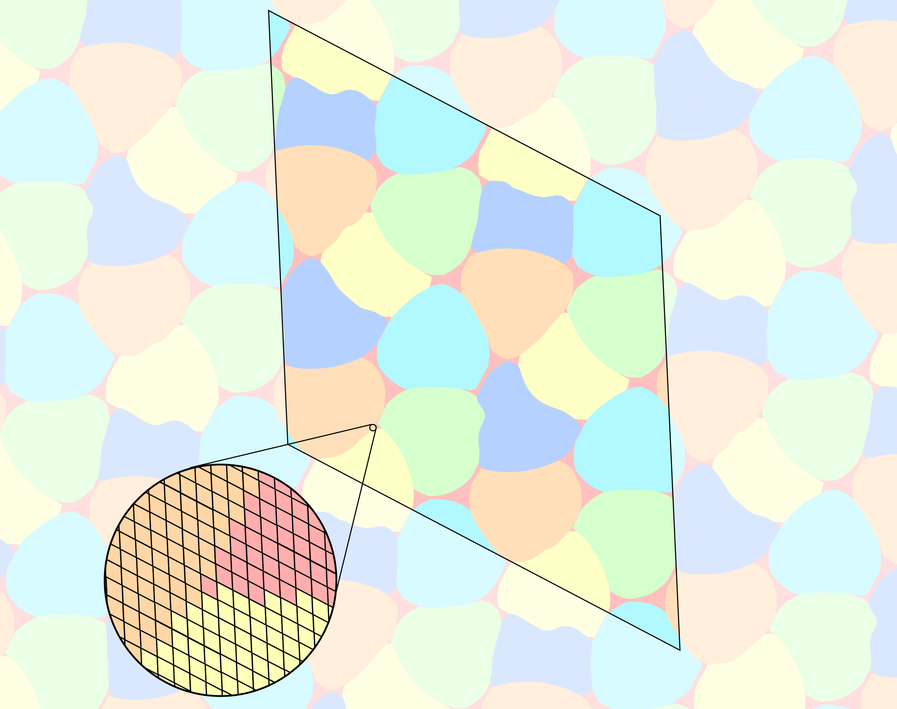

# [ICML25] Neural Discovery in Mathematics

This repository contains the code for the ICML2025 paper ["Neural Discovery in Mathematics: Do Machines Dream of Colored Planes?"](https://arxiv.org/abs/2501.18527).

*Authors: [Konrad Mundinger](https://iol.zib.de/team/konrad-mundinger.html), [Max Zimmer](https://maxzimmer.org/), [Aldo Kiem](https://iol.zib.de/team/aldo-kiem.html), [Christoph Spiegel](http://www.christophspiegel.berlin/), [Sebastian Pokutta](http://www.pokutta.com/)*

[[`Paper`](https://arxiv.org/abs/2501.18527)] [[`Blogpost`](https://maxzimmer.org/blog/2025/neural-discovery-in-mathematics-do-machines-dream-of-colored-planes/)] [[`BibTeX`](#citing-the-paper)]




## Environment setup


We use Python 3.11.9. To install the required dependencies, run:

```bash
pip install -r requirements.txt
```

We use [Weights & Biases (wandb)](https://wandb.ai/) for experiment tracking and logging. To enable it:

1. Create a free account at [wandb.ai](https://wandb.ai/).
2. Log in via the command line:

    ```bash
    wandb login
    ```

    This will prompt you to paste your API key, which can be found in your W&B account settings.


You can find your logs, metrics, and model checkpoints on the project dashboard linked in your Weights & Biases account.

## Running the code

You can start a run by invoking 
```
python main.py
```
This will use the parameters specified directly in the `main.py` file. For the different variants described in the paper, we provide the following config files:

### Vanilla Hadwiger-Nelson problem

To run the vanilla Hadwiger-Nelson problem with seven colors in 2D, use:

```
python main.py --config=configs/vanilla_seven_color.yaml
```

### Almost coloring

To minimize the occurence of the last color with a lagrangian multiplier, use:

```
python main.py --config=configs/lagrange_six_color.yaml
```

### Polychromatic Number

For training on a range of distances for the last color, use:

```
python main.py --config=configs/polychromatic_number.yaml
```

### Hadwiger-Nelson in three dimensions

For coloring $3$-dimensional space, use:

```
python main.py --config=configs/coloring_space.yaml
```

Note that no visualizations will be generated.

## Important Notes

If you want to run the experiments for different amounts of colors or change any other parameters, you can modify the `.yaml` files accordingly. Please note that a single run will most likely not yield the best results. We obtained our results by running each experiment multiple times and selecting the best runs afterwards.

## Discrete almost-colorings

We provide an almost-coloring of the plane with five colors and an almost-coloring of three-dimensional space with 14 colors, both obtained using Algorithm 1 from our paper. They are available in the `constructions` folder and can be downloaded using `git-lfs`.

### Almost-5 coloring

The files in `constructions/almost-5-coloring-2D` contain a discretized almost-5-coloring.  
The coloring is periodic on the parallelogram spanned by the vectors **v₁** and **v₂**, given in `parallelogram.csv`.  
It is constant on small parallelograms, which are spanned by scaled versions of **v₁** and **v₂**.

The file `parallelogram.csv` includes both the original vectors (**v₁**, **v₂**) (columns `x` and `y`) and their scaled versions (**v₁_small**, **v₂_small**), listed under the columns `x_hat` and `y_hat`.

The rows of `grid.csv` specify the corner of a small parallelogram (columns `x` and `y`) and the color assigned to that parallelogram (column `color`).




### Almost-14 coloring

Similarly, the files in `constructions/almost-14-coloring-3D` contain a discretized almost-14-coloring of three-dimensional space.


## Contact

If you have further questions or want to discuss our work, please send an e-mail to mundinger@zib.de or spiegel@zib.de.

## Citing the paper

If you find this work helpful, please consider citing our paper:

```
@inproceedings{mundinger2025neural,
  title = {Neural Discovery in Mathematics: Do Machines Dream of Colored Planes?},
  shorttitle = {Neural Discovery},
  booktitle = {Forty-Second International Conference on Machine Learning},
  author = {Mundinger, Konrad and Zimmer, Max and Kiem, Aldo and Spiegel, Christoph and Pokutta, Sebastian},
  year = {2025},
  month = jul
}
```
